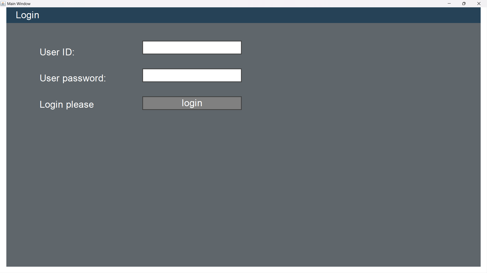
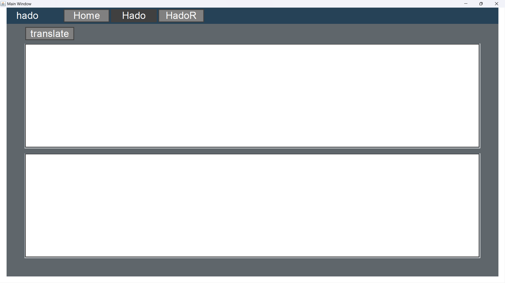

## 🕷️Spider🕸️ 

---
### Brief explanation

In my spider project, I'm creating translate for my own language called Hado (not a coding language). 
I'm still learning, so I'm tackling new topics that I haven't explored yet with Java.

---
### Explanation per screen

#### Login screen 
In this screen you must log in to access the translator.

#### Home screen
On the home screen there are sort of small 
explanations of what each screen does (besides the home, login screens).

#### Hado translate screen
on the hado screen the top field is for your own language if you click on translate 
it will be set to Hado language in the bottom field.

#### HadoR translate screen
On HadoR screen you can set Hado language back to your own language,
it works the same as on the Hado Screen.

---
### what I'm still working on
- User ID and password security 
- Small bugs
---
### ideas that are coming
- work with a database
- keep words that have all been translated in the database
---

    

